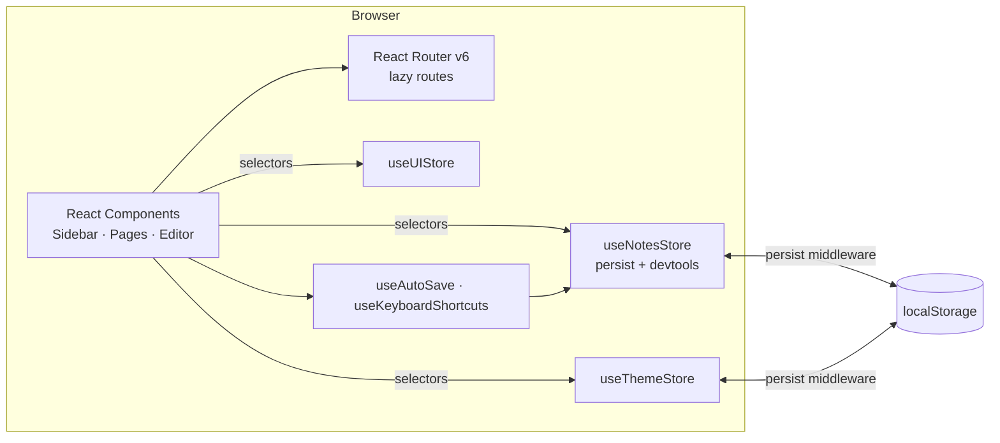

# Notes Web App — Step-by-Step Build Guide

> **Archived: original build playbook.** This document is the original roadmap used to build the Notes Web App. It is preserved as a making-of narrative and a reference for how the project was assembled phase by phase. The codebase may have evolved since this guide was written; for the current setup, architecture, scripts, and deployment notes, see [../README.md](../README.md).

---

> **Project Summary:** Notes Web App is a modern, local-first note-taking application. It supports full CRUD over notes, a colored tagging system, Markdown editing with a live debounced preview (Write / Preview / Split modes), full-text search, and tag-based filtering. Notes auto-save with a 1-second debounce and a visible save-status indicator. The UI ships a responsive split layout, Light / Dark / System theming with persisted preference, global keyboard shortcuts, toast notifications, an error boundary, lazy-loaded routes, and a custom 404 page. All data is persisted to `localStorage` with cross-tab synchronization and quota handling — no backend or network required. Built with React 18, TypeScript, Vite, Zustand, React Hook Form, Zod, React Router v6, Tailwind CSS, and react-markdown.

Each step below is a self-contained prompt. Execute them in order.

Stack: React 18 + TypeScript + Vite + Zustand (persist + devtools) + React Hook Form + Zod + React Router v6 + Tailwind CSS (class-based dark mode) + react-markdown + uuid.

---

## Table of Contents

**PHASE 1 — Foundation & Tooling**

- STEP 1 — Project Scaffolding & Dependency Setup
- STEP 2 — Tailwind, Global Styles & Theme Tokens
- STEP 3 — Domain Types & Validation Schemas

**PHASE 2 — State & Persistence**

- STEP 4 — localStorage Utility Layer
- STEP 5 — Notes Store (Zustand persist + devtools + selectors)
- STEP 6 — Theme Store & UI Store
- STEP 7 — Custom Hooks (useAutoSave, useLocalStorage, useKeyboardShortcuts)

**PHASE 3 — UI Primitives & Feedback**

- STEP 8 — Base UI Primitives (Button, Input, SearchBar)
- STEP 9 — Tag Components (TagBadge, TagSelector)
- STEP 10 — Feedback & Resilience (Toast, Modal, Skeleton, PageLoader, ErrorBoundary, ThemeToggle)

**PHASE 4 — Layout, Pages & Routing**

- STEP 11 — Layout Shell (SplitLayout, Sidebar, Footer)
- STEP 12 — Note Components (NoteCard, NoteEditor, NoteForm)
- STEP 13 — Pages (NotesListPage, NoteDetailPage, NotFoundPage)
- STEP 14 — App Composition & Routing (App, main)

**PHASE 5 — Polish & Deploy**

- STEP 15 — Dark Mode Wiring & Accessibility Pass
- STEP 16 — Keyboard Shortcuts Integration
- STEP 17 — Build, Verify & Deploy

**Appendices**

- Appendix A — Shared Constants
- Appendix B — Common Pitfalls
- Appendix C — Pre-Flight Checklist

---

## Global Build Rules (apply to EVERY step)

- **No git operations.** Do not run `git` commands, do not commit, and do not push. Version control is handled manually by the user.
- Do not install unapproved packages. Only the dependencies listed in STEP 1 are required; add nothing beyond the project stack without explicit approval.
- Do not run long-running processes (dev servers, watchers) unless the user requests it. Prefer one-shot checks like `npx tsc --noEmit` and `npm run build`.
- Treat every step as self-contained: it states its goal, the files it touches, and an acceptance check.
- Keep code clean, readable, and typed. Prefer ES6+, React Hooks, and `async/await`.
- Favor native methods over new dependencies. Apply DRY: extract reusable logic into hooks, stores, and utilities.
- Prioritize security, accessibility (a11y), and performance in every component.
- Use English for all identifiers, filenames, variables, functions, and types. User-facing copy is Turkish.

---

## Architecture at a Glance

The app is a fully client-side SPA. There is no server; persistence is the browser's `localStorage`, and state is centralized in Zustand stores.

Key relationships:

- **Components** subscribe to stores through narrow selectors to minimize re-renders.
- **`useNotesStore`** owns notes, tags, a `tagsById` lookup map, and filter state; it persists `notes`/`tags`/`tagsById` via Zustand's `persist` middleware.
- **`useThemeStore`** applies a `dark` class on `document.documentElement` and persists the chosen theme.
- **`useUIStore`** holds transient global UI state such as the keyboard-shortcuts modal.
- **`useAutoSave`** debounces writes from the editor into the notes store.

---

# PHASE 1 — FOUNDATION & TOOLING

---

## STEP 1 — Project Scaffolding & Dependency Setup

**Goal:** Stand up a Vite + React + TypeScript project with the exact runtime and dev dependencies.

**Files/folders:**

- `package.json`, `tsconfig.json`, `tsconfig.node.json`, `vite.config.ts`
- `index.html`, `src/main.tsx`, `src/vite-env.d.ts`
- `.gitignore`

**Dependencies:**

- Runtime: `react`, `react-dom`, `react-router-dom`, `zustand`, `react-hook-form`, `@hookform/resolvers`, `zod`, `react-markdown`, `uuid`
- Dev: `typescript`, `vite`, `@vitejs/plugin-react`, `tailwindcss`, `postcss`, `autoprefixer`, `@types/react`, `@types/react-dom`, `@types/uuid`

**Implementation notes:**

- Scripts: `dev` → `vite`, `build` → `tsc && vite build`, `preview` → `vite preview`, `lint` → ESLint over `ts,tsx`.
- `tsconfig.json` uses `strict`, `noUnusedLocals`, `noUnusedParameters`, `noFallthroughCasesInSwitch`, bundler module resolution, `jsx: react-jsx`, and a `@/*` path alias to `src/*`.
- Ensure `src/vite-env.d.ts` contains `/// <reference types="vite/client" />` so `import.meta.env` is typed.
- `.gitignore` must ignore `node_modules` and `dist`.

**Acceptance:** `npm install` succeeds and `npx tsc --noEmit` runs against an empty `src` without config errors.

---

## STEP 2 — Tailwind, Global Styles & Theme Tokens

**Goal:** Configure Tailwind with class-based dark mode, primary color tokens, and global Markdown/scrollbar styles.

**Files/folders:**

- `tailwind.config.js`, `postcss.config.js`, `src/index.css`

**Implementation notes:**

- `tailwind.config.js`: set `darkMode: 'class'`, `content` globbing `index.html` and `src/**/*.{js,ts,jsx,tsx}`, extend `colors.primary` (50–900 sky scale), `fontFamily` (Inter / Fira Code), and an optional `spin-slow` animation.
- `src/index.css`: import Tailwind layers; in `@layer base` style `body` for light + `dark:` variants and custom scrollbars (WebKit + Firefox). In `@layer components` define `.btn`, `.btn-*`, `.input`, `.card` with dark variants.
- Add `.prose-notes` Markdown styles (headings, code, pre, blockquote, table, links) with `dark:` variants.
- Add `@keyframes fade-in` + `.animate-fade-in`, a smooth theme transition on `html`, and a `:focus-visible` outline.

**a11y/performance:** Use `:focus-visible` for keyboard focus rings; keep color contrast adequate in both themes.

**Acceptance:** Tailwind classes compile; `dark:` variants are recognized by the build.

---

## STEP 3 — Domain Types & Validation Schemas

**Goal:** Define the data model and form validation.

**Files/folders:**

- `src/types/index.ts`, `src/utils/validation.ts`

**Implementation notes:**

- `types/index.ts`: export `Note` (`id`, `title`, `content`, `tags: string[]`, `createdAt`, `updatedAt`), `Tag` (`id`, `name`, `color`), `NoteFormData`, `TagFormData`, a `TAG_COLORS` tuple (`as const`), and a `TagColor` union derived from it.
- `validation.ts`: Zod `noteSchema` (`title` required, 1–100 chars; `content` default `''`; `tags` default `[]`) and `tagSchema` (`name` 1–30; `color` hex regex). Export inferred types `NoteSchemaType`, `TagSchemaType`.

**Acceptance:** Types compile and `z.infer` types are exported for reuse in forms.

---

# PHASE 2 — STATE & PERSISTENCE

---

## STEP 4 — localStorage Utility Layer

**Goal:** A resilient, SSR-safe storage helper with quota detection and default tag seeding.

**Files/folders:**

- `src/utils/storage.ts`

**Implementation notes:**

- Guard with an `isStorageAvailable()` probe and detect `QuotaExceededError` across browsers.
- Return a typed `StorageResult<T>` (`success`, `data?`, `error?`) from each operation rather than throwing.
- Expose `getNotes/setNotes`, `getTags/setTags`, `clearAll`, `getUsage`, `exportData`, `importData`.
- Provide a private `getDefaultTags()` (Personal, Work, Idea, Important) used as the first-run tag set.

**Implementation notes (design choice):** The Zustand `persist` middleware (STEP 5) is the primary persistence mechanism. This utility remains available for import/export and storage diagnostics.

**Acceptance:** All functions return `StorageResult` and never throw on read/write failures.

---

## STEP 5 — Notes Store (Zustand persist + devtools + selectors)

**Goal:** The central notes/tags store with optimized selectors and O(1) tag lookup.

**Files/folders:**

- `src/store/useNotesStore.ts`

**Implementation notes:**

- Wrap the store in `devtools(persist(...))`. Persist key: `notes-app-storage`; `partialize` to persist only `notes`, `tags`, `tagsById`.
- State: `notes`, `tags`, `selectedNote`, `tagsById`, `searchQuery`, `selectedTags`.
- Seed initial `tags` with default tags and build `tagsById` so first-time users start with tags. On `onRehydrateStorage`, rebuild `tagsById` from persisted `tags`.
- Actions: `addNote` (returns the new `Note`), `updateNote`, `deleteNote`, `selectNote`, `addTag`, `deleteTag` (also strips the tag from all notes and filters), `setSearchQuery`, `setSelectedTags`, `toggleTagFilter`, `clearFilters`. Pass action names as the third `set` argument for devtools traceability.
- Export selectors: `selectNotes`, `selectTags`, `selectTagsById`, `selectSearchQuery`, `selectSelectedTags`, `selectFilteredNotes` (early-returns when no filters; AND-matches selected tags), `selectNoteById(id)`, plus action selectors (`selectAddNote`, etc.).

**performance:** Components must use selectors, not whole-store destructuring, to avoid needless re-renders. `tagsById` gives O(1) tag resolution in `NoteCard`.

**Acceptance:** Creating/updating/deleting notes and tags persists across reloads; `selectFilteredNotes` honors search + tag filters.

---

## STEP 6 — Theme Store & UI Store

**Goal:** Persisted theming and transient global UI state.

**Files/folders:**

- `src/store/useThemeStore.ts`, `src/store/useUIStore.ts`

**Implementation notes:**

- `useThemeStore`: `Theme = 'light' | 'dark' | 'system'`. An `applyTheme()` helper toggles the `dark` class on `document.documentElement`, resolving `system` via `matchMedia('(prefers-color-scheme: dark)')`. Apply the initial theme synchronously on module load to prevent flash, persist under `notes-app-theme`, re-apply on rehydrate, and subscribe to OS theme changes when in `system` mode. Export `selectTheme`, `selectSetTheme`.
- `useUIStore`: holds `isShortcutsModalOpen` with `open/close/toggle` actions and matching selectors.

**Acceptance:** Switching themes updates the root class immediately and survives reloads; `system` mode reacts to OS changes.

---

## STEP 7 — Custom Hooks (useAutoSave, useLocalStorage, useKeyboardShortcuts)

**Goal:** Reusable behavior for debounced saving, raw storage sync, and global shortcuts.

**Files/folders:**

- `src/hooks/useAutoSave.ts`, `src/hooks/useLocalStorage.ts`, `src/hooks/useKeyboardShortcuts.ts`

**Implementation notes:**

- `useAutoSave(callback, data, delay = 1000)`: ref-based debounce; exposes `{ saveNow, cancel, status, error }` with `status: 'idle' | 'saving' | 'saved' | 'error'`; SSR-safe; supports sync or async callbacks with try/catch.
- `useLocalStorage(key, initialValue)`: SSR-safe, quota-aware, cross-tab sync via the `storage` event (including deletions); returns `{ value, setValue, removeValue, error, isAvailable }`.
- `useKeyboardShortcuts(shortcuts, { enabled })`: attaches a `keydown` listener, skips input/textarea/contenteditable except for allow-listed shortcuts (`save`, `shortcuts`), and matches modifiers (Cmd on macOS, Ctrl elsewhere). Export `DEFAULT_SHORTCUTS`, `formatShortcut`, `getModifierKey`, and `useAppKeyboardShortcuts(actions)` to bind handlers.

**Acceptance:** Auto-save fires once per debounce window; shortcuts trigger only with correct modifiers and respect input focus rules.

---

# PHASE 3 — UI PRIMITIVES & FEEDBACK

---

## STEP 8 — Base UI Primitives (Button, Input, SearchBar)

**Goal:** Accessible, themeable building blocks.

**Files/folders:**

- `src/components/ui/Button.tsx`, `Input.tsx`, `SearchBar.tsx`

**Implementation notes:**

- `Button`: `forwardRef`, variants (`primary`/`secondary`/`danger`/`ghost`), sizes (`sm`/`md`/`lg`), `isLoading` spinner, and `type="button"` by default to avoid accidental form submits. Include dark variants and focus rings.
- `Input`: `forwardRef`, optional `label`, `error`, `helperText`; wires `aria-invalid` and `aria-describedby`; dark variants.
- `SearchBar`: memoized, leading search icon, clear button when non-empty, `aria-label="Search notes"` (this label is the hook used by the `Ctrl/Cmd + F` shortcut).

**a11y:** Every interactive element has a visible focus ring and an accessible name.

**Acceptance:** Primitives render in both themes and forward refs/props correctly.

---

## STEP 9 — Tag Components (TagBadge, TagSelector)

**Goal:** Display and manage colored tags.

**Files/folders:**

- `src/components/tags/TagBadge.tsx`, `TagSelector.tsx`

**Implementation notes:**

- `TagBadge`: memoized; renders a pill tinted from the tag color (`${color}20` background). When selected, set the Tailwind ring via the `--tw-ring-color` CSS custom property (not a non-standard `ringColor` style key). Supports keyboard activation (`Enter`/`Space`) and an optional remove button.
- `TagSelector`: reads `selectTags`/`selectAddTag`/`selectDeleteTag`; supports toggling, inline creation with a `TAG_COLORS` radio-group color picker, and deletion (confirm before delete). `Enter` creates, `Escape` cancels.

**Acceptance:** Tags can be created, colored, selected, and removed; selected state is visually distinct and keyboard accessible.

---

## STEP 10 — Feedback & Resilience (Toast, Modal, Skeleton, PageLoader, ErrorBoundary, ThemeToggle)

**Goal:** App-wide feedback, loading, and error handling primitives.

**Files/folders:**

- `src/components/ui/Toast.tsx`, `Modal.tsx`, `Skeleton.tsx`, `PageLoader.tsx`, `ThemeToggle.tsx`
- `src/components/error/ErrorBoundary.tsx`

**Implementation notes:**

- `Toast`: context + `ToastProvider` + `useToast()`; auto-dismiss with per-type styling (success/error/warning/info), `role="alert"`, `aria-live="polite"`.
- `Modal`: accessible dialog with focus trap, `Escape` to close, overlay click to dismiss, body scroll lock, and a `ConfirmDialog` variant intended to replace native `window.confirm`.
- `Skeleton` + presets (`NoteCardSkeleton`, `SidebarSkeleton`, `EditorSkeleton`, `HeaderSkeleton`) for loading states.
- `PageLoader`: Suspense fallback spinner.
- `ErrorBoundary`: class component; logs errors, shows a fallback with "Try Again" / "Reload Page", and surfaces stack details only when `import.meta.env.DEV`.
- `ThemeToggle`: cycles light → dark → system with an icon + descriptive `aria-label`.

**Acceptance:** Toasts stack and auto-dismiss; modal traps focus; error boundary catches render errors and offers recovery.

---

# PHASE 4 — LAYOUT, PAGES & ROUTING

---

## STEP 11 — Layout Shell (SplitLayout, Sidebar, Footer)

**Goal:** The responsive two-pane shell with sidebar navigation.

**Files/folders:**

- `src/components/layout/SplitLayout.tsx`, `Sidebar.tsx`, `Footer.tsx`

**Implementation notes:**

- `SplitLayout`: fixed sidebar on desktop, off-canvas drawer on mobile with overlay; `Escape` closes the drawer; body scroll lock while open; dark backgrounds.
- `Sidebar`: title, `SearchBar`, tag filter chips, the filtered notes list (`NoteCard`s), a "New Note" button, and the `Footer`. Reads store via selectors and memoizes derived values.
- `Footer`: creator credits, a keyboard-shortcuts button (opens the modal via `useUIStore`), and `ThemeToggle`.

**Acceptance:** Layout is responsive; mobile drawer opens/closes via button, overlay, and `Escape`.

---

## STEP 12 — Note Components (NoteCard, NoteEditor, NoteForm)

**Goal:** The note preview card and the Markdown editing form.

**Files/folders:**

- `src/components/notes/NoteCard.tsx`, `NoteEditor.tsx`, `NoteForm.tsx`

**Implementation notes:**

- `NoteCard`: memoized; resolves tags via `selectTagsById` (O(1)); strips Markdown for a content preview; formats `updatedAt` with `toLocaleDateString('tr-TR', ...)`; keyboard-activatable (`role="button"`, `tabIndex=0`).
- `NoteEditor`: memoized; Write / Preview / Split modes via a `role="tablist"`; a `DebouncedMarkdownPreview` (≈200 ms) avoids re-rendering on every keystroke; mode buttons use `type="button"`; dark variants on textarea and preview.
- `NoteForm`: React Hook Form + `zodResolver(noteSchema)`; `Controller` for `tags` and `content`; `watch()` propagates changes upward via an `onChange` callback to drive auto-save; a hidden submit button supports `saveNow`.

**performance:** Memoize handlers, icons, and class strings; debounce preview rendering.

**Acceptance:** Editing updates the form model; switching modes preserves content; preview renders Markdown safely.

---

## STEP 13 — Pages (NotesListPage, NoteDetailPage, NotFoundPage)

**Goal:** Route-level screens.

**Files/folders:**

- `src/pages/NotesListPage.tsx`, `NoteDetailPage.tsx`, `NotFoundPage.tsx`

**Implementation notes:**

- `NotesListPage`: empty/welcome state plus a feature list and a "Create New Note" CTA; reads `selectNotes` and `selectFilteredNotes`.
- `NoteDetailPage`: handles both new (`/note/new`) and existing (`/note/:id`) notes. On first auto-save of a new note it calls `addNote`, captures the id, and `navigate(..., { replace: true })` to the canonical URL. Shows a save-status indicator (saving / saved / unsaved) and a delete action (confirm first). Renders a "not found" state for missing ids.
- `NotFoundPage`: friendly 404 with "Go to Home" / "Go Back".

**Acceptance:** Creating a note transitions cleanly to its URL without polluting history; deleting returns home; unknown ids show the not-found state.

---

## STEP 14 — App Composition & Routing

**Goal:** Wire providers, routes, lazy loading, and global shortcuts.

**Files/folders:**

- `src/App.tsx`, `src/main.tsx`

**Implementation notes:**

- `main.tsx`: render tree is `StrictMode > ErrorBoundary > BrowserRouter > ToastProvider > App`, importing `./index.css`.
- `App.tsx`: `lazy` + `Suspense` (fallback `PageLoader`) for `NotesListPage`, `NoteDetailPage`, `NotFoundPage`. Routes: `/`, `/note/new`, `/note/:id`, and `*` → `NotFoundPage`. Bind global shortcuts via `useAppKeyboardShortcuts` (new note, focus search, show shortcuts) and render the `KeyboardShortcutsModal`. Close the modal on route change.

**Acceptance:** Routes resolve, pages load as separate chunks, and the shortcuts modal opens via `Ctrl/Cmd + /`.

---

# PHASE 5 — POLISH & DEPLOY

---

## STEP 15 — Dark Mode Wiring & Accessibility Pass

**Goal:** Ensure dark mode is real and the UI is accessible.

**Implementation notes:**

- Confirm `darkMode: 'class'` in `tailwind.config.js` and that every surface (layout, sidebar, cards, editor, pages, modals, toasts) has `dark:` variants.
- Verify the theme store applies the `dark` class before first paint (no flash).
- a11y sweep: labels/`aria-*` on inputs and buttons, `role`/`aria-selected` on tabs and list items, `aria-live` on the save status and toasts, visible focus rings everywhere, and `Escape` handling on overlays.

**Acceptance:** Toggling theme restyles the entire app; keyboard-only navigation works end to end.

---

## STEP 16 — Keyboard Shortcuts Integration

**Goal:** Make documented shortcuts work across the app.

**Implementation notes:**

- Global (in `App`): `Ctrl/Cmd + N` (new note), `Ctrl/Cmd + F` (focus the search input found by its `aria-label`), `Ctrl/Cmd + /` (shortcuts modal).
- Page/editor level (extensible): `Ctrl/Cmd + S` (save), `Ctrl/Cmd + Shift + D` (delete), `Ctrl/Cmd + 1/2/3` (editor modes).
- The `KeyboardShortcutsModal` lists shortcuts grouped by category using `formatShortcut`, which renders Cmd/Ctrl based on OS.

**Acceptance:** Each shortcut performs its action and does not hijack typing inside inputs (except the allow-listed ones).

---

## STEP 17 — Build, Verify & Deploy

**Goal:** Validate the production build and prepare deployment.

**Implementation notes:**

- Type-check: `npx tsc --noEmit`. Build: `npm run build` (runs `tsc && vite build`). Optionally `npm run preview`.
- Expect lazy chunks per page in the build output and a single CSS bundle.
- Keep `dist/` out of version control (already in `.gitignore`).
- Netlify: build command `npm run build`, publish directory `dist`.

**Acceptance:** `tsc` reports no errors, `vite build` succeeds, and the preview renders correctly in both themes.

---

# Appendix A — Shared Constants

- **Storage keys:** notes/state → `notes-app-storage` (Zustand persist); theme → `notes-app-theme`; legacy raw util keys → `notes-app-notes`, `notes-app-tags`.
- **Auto-save debounce:** `1000 ms`. **Markdown preview debounce:** `~200 ms`.
- **Tag palette (`TAG_COLORS`):** `#ef4444`, `#f97316`, `#eab308`, `#22c55e`, `#14b8a6`, `#3b82f6`, `#8b5cf6`, `#ec4899`, `#6b7280`.
- **Default tags:** Personal (`#3b82f6`), Work (`#22c55e`), Idea (`#eab308`), Important (`#ef4444`).
- **Validation:** title 1–100 chars (required), tag name 1–30 chars, color must match `^#[0-9A-Fa-f]{6}$`.
- **Search input hook:** `input[aria-label="Search notes"]` (used by `Ctrl/Cmd + F`).

---

# Appendix B — Common Pitfalls

- **Whole-store subscriptions:** destructuring the entire Zustand store causes broad re-renders. Always use the exported selectors.
- **Non-standard `ringColor` style:** Tailwind ring color must be set via the `--tw-ring-color` CSS variable, not a `ringColor` style key (TypeScript will reject the latter).
- **Buttons inside forms:** mode/action buttons must declare `type="button"`; otherwise they submit the form. Keep the explicit hidden submit for `saveNow`.
- **Theme flash (FOUC):** apply the resolved theme class on the document root at module load, before React renders.
- **New-note history pollution:** after the first auto-save of a new note, navigate to its URL with `{ replace: true }`.
- **localStorage edge cases:** always guard availability and catch `QuotaExceededError`; never assume `localStorage` exists (private mode/SSR).
- **Persisted `tagsById`:** rebuild it on rehydrate so it never drifts from the persisted `tags` array.
- **Duplicate/backup files:** avoid leaving editor sync artifacts (e.g. `*-DESKTOP-*` copies) in the tree; they create dead, conflicting code paths.

---

# Appendix C — Pre-Flight Checklist

- [ ] `npm install` completes without errors.
- [ ] `npx tsc --noEmit` passes (strict mode, no unused locals/params).
- [ ] `npm run build` succeeds and emits lazy page chunks.
- [ ] Notes and tags persist across reloads; default tags appear for a fresh profile.
- [ ] Search and tag filtering work together (AND semantics for tags).
- [ ] Auto-save shows saving → saved transitions; new notes get a stable URL.
- [ ] Light / Dark / System themes restyle the entire UI with no flash.
- [ ] Keyboard shortcuts work and respect input focus rules.
- [ ] Error boundary catches a thrown render error and offers recovery.
- [ ] No leftover backup/duplicate source files; `dist/` is gitignored.

---
